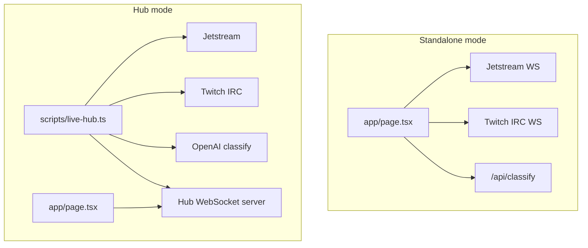

# poc-worldcup-viral

A **proof-of-concept live dashboard** for comparing real-time “velocity” across two public firehoses: **Bluesky** (via AT Proto Jetstream) and **Twitch** (via IRC WebSocket). Each **lane** tracks events in a **60-second rolling window**, shows a **sparkline** of activity over that minute, a **LAST 10s** headline count, and a short **recent feed** of matching posts or chat lines.

On top of raw counts, the app periodically batches lane text through **OpenAI (`gpt-4o-mini`)** to estimate **five emotion scores** (joy, anger, sadness, surprise, fear) per lane. A **global emotional state** strip in the header blends those scores across lanes, weighted by each lane’s recent volume. The UI is optimized for a dark, monospace, “mission control” feel and is implemented in Next.js (App Router) with a **browser-first** default and an optional **single-process live hub** so one worker can feed many tabs without duplicating firehose or API traffic.

---

## Table of contents

- [What it does](#what-it-does)
- [Architecture](#architecture)
- [Tech stack](#tech-stack)
- [Requirements](#requirements)
- [Getting started](#getting-started)
- [Scripts](#scripts)
- [Configuration](#configuration)
- [How metrics and classification work](#how-metrics-and-classification-work)
- [Data sources and caveats](#data-sources-and-caveats)
- [Browser and deployment notes](#browser-and-deployment-notes)
- [Project layout](#project-layout)
- [Troubleshooting](#troubleshooting)
- [License and third-party terms](#license-and-third-party-terms)

---

## What it does

### Bluesky · LIVE

- Opens a WebSocket to **Jetstream** (`jetstream2.us-east.bsky.network`) and subscribes to `app.bsky.feed.post` commits.
- For each new post, extracts plain text from the commit payload.
- If the text **contains any** of the configured keywords (case-insensitive substring match), the post increments **one lane per matched keyword** and appears in that lane’s recent list.
- Keywords and lane list live in **`lib/live-shared.ts`** (World Cup / sports-flavored defaults such as `goal`, `penalty`, `worldcup`, `fifa`, `soccer`, `football`, etc.).

### Twitch · LIVE

- Opens a WebSocket to **Twitch IRC** (`irc-ws.chat.twitch.tv:443`).
- Uses an anonymous read-only pattern: random `justinfan#####` nick, `PASS SCHMOOPIIE`, `JOIN` for each configured channel.
- Parses `PRIVMSG` lines; only messages on configured channels count toward those lanes.
- Channel list is also defined in **`lib/live-shared.ts`** (high-volume example channels; change to match your demo).

### Per-lane UI

- **Emotion bar**: stacked percentages from the latest successful classify batch for that lane (or “awaiting classification” until enough messages accumulate).
- **Dominant**: label for the strongest emotion in that batch.
- **LAST 10s**: total event count across the **newest ten 1-second buckets** in the rolling window (not the full 60-second total).
- **Sparkline**: [Recharts](https://recharts.org/) area chart over the last 60 one-second buckets (oldest → newest left → right).
- **Recent lines**: up to 5 items — Bluesky post text, or Twitch `username: message`.

### Header

- **TOTAL EVENTS/SEC**: sum of all lanes’ LAST 10s counts, divided by 10 (events per second implied by the last ten seconds).
- **API spend**: estimated USD from `gpt-4o-mini` list pricing and token usage; in **tab mode** it accumulates per browser session; in **hub mode** it reflects the hub process (shared across viewers).
- **GLOBAL EMOTIONAL STATE**: volume-weighted blend of per-lane emotion scores using each lane’s LAST 10s weight.

---

## Architecture

**Default (no hub):** streaming and per-lane timestamp aggregation run **in the browser** on the home page (`app/page.tsx`). Classification runs on an interval: the page POSTs batched strings to **`POST /api/classify`**, which calls OpenAI on the **Next.js server** (requires `OPENAI_API_KEY` in `.env.local`).

**Hub mode:** set **`NEXT_PUBLIC_LIVE_HUB_WS`** (e.g. `ws://localhost:3333`). The page **only** opens a WebSocket to the hub; **`scripts/live-hub.ts`** connects to Jetstream and Twitch, aggregates, classifies in-process, and **broadcasts JSON snapshots** to all connected clients. Firehose connections and OpenAI calls happen **once** per hub, not per tab.



---

## Tech stack

| Layer | Choice |
|--------|--------|
| Framework | [Next.js](https://nextjs.org/) **15.5** (App Router) |
| UI | [React](https://react.dev/) **19** |
| Language | [TypeScript](https://www.typescriptlang.org/) **5** |
| Styling | [Tailwind CSS](https://tailwindcss.com/) **4** (`@import "tailwindcss"`, `@theme inline` in `app/globals.css`) |
| Charts | [Recharts](https://recharts.org/) **3** |
| Classification | [OpenAI](https://platform.openai.com/) **Node SDK** (`gpt-4o-mini`) |
| Live hub | [`ws`](https://github.com/websockets/ws) WebSocket server + client |
| Env (hub) | [`dotenv`](https://github.com/motdotla/dotenv) loads `.env.local` / `.env` for the hub script |
| Bundler (dev/build) | [Turbopack](https://nextjs.org/docs/app/api-reference/config/next-config-js/turbopack) via `next dev` / `next build` flags |

Fonts: [Geist](https://vercel.com/font) Sans + Mono via `next/font/google` in `app/layout.tsx`.

---

## Requirements

- **Node.js** — use a current LTS (the repo targets modern Node; lockfile and tooling align with **Node 20+**).
- **npm** (this repo ships `package-lock.json`; `pnpm` / `yarn` work if you prefer, but scripts below use `npm`).
- **OpenAI** — optional for emotion bars: without `OPENAI_API_KEY`, classification returns empty scores and the UI stays in “awaiting classification” until you add a key (server route or hub).

---

## Getting started

Clone the repository, install dependencies, and start the dev server:

```bash
cd poc-worldcup-viral
npm install
npm run dev
```

Open [http://localhost:3000](http://localhost:3000). You should see **TWITCH · LIVE** and **BLUESKY · LIVE** sections with cards filling as live data arrives.

Add **`OPENAI_API_KEY`** to **`.env.local`** at the project root so `/api/classify` can run (Next.js loads this automatically for API routes).

**Run app + hub together** (hub on port 3333, Next dev on 3000, env wired for the browser):

```bash
npm run dev:live
```

`dev:live` runs `npm run hub` and `npm run dev` concurrently; ensure `.env.local` includes both `OPENAI_API_KEY` and `NEXT_PUBLIC_LIVE_HUB_WS=ws://localhost:3333` when using this script, or set `NEXT_PUBLIC_LIVE_HUB_WS` in the shell before `npm run dev` if you start the hub manually.

Production build:

```bash
npm run build
npm start
```

---

## Scripts

| Command | Description |
|---------|-------------|
| `npm run dev` | Next.js dev server with **Turbopack** |
| `npm run hub` | Live worker: Jetstream + Twitch + classify + WebSocket fan-out (loads `.env.local`) |
| `npm run dev:live` | **`concurrently`**: hub + Next dev (see Getting started) |
| `npm run build` | Production build with **Turbopack** |
| `npm start` | Serve the production build |
| `npm run lint` | ESLint (Next.js config) |

---

## Configuration

### Shared constants (`lib/live-shared.ts`)

| Export | Role |
|--------|------|
| `JETSTREAM_URL` | Jetstream WebSocket URL (default US East + `wantedCollections=app.bsky.feed.post`). |
| `TWITCH_IRC_URL` | Twitch IRC WebSocket URL. |
| `BLUESKY_KEYWORDS` | Keywords for Bluesky lanes (substring match on post `text`). |
| `TWITCH_CHANNELS` | Channel names **without** `#`; must match IRC channel names for `JOIN`. |
| `WINDOW_MS` / `BUCKET_MS` / `BUCKET_COUNT` | Rolling window and 1-second buckets (defaults: 60s, 1s, 60 buckets). |
| `TICK_MS` | Hub snapshot / UI bucket refresh interval (default **500** ms). |
| `CLASSIFY_INTERVAL_MS` | How often each lane’s message buffer is flushed to the classifier (default **5000** ms). |
| `RECENT_MAX` | Max recent lines per lane (default **5**). |
| `LANE_IDS` | Derived: `tw:<channel>` then `bs:<keyword>`. |

### Environment variables

| Variable | Where | Role |
|----------|--------|------|
| `OPENAI_API_KEY` | `.env.local` | Required for real emotion scores via `/api/classify` or `npm run hub`. |
| `NEXT_PUBLIC_LIVE_HUB_WS` | `.env.local` or shell | If set (e.g. `ws://localhost:3333`), the page uses **hub snapshots** and skips in-browser Jetstream/Twitch and tab-side classify sweeps. |
| `LIVE_HUB_PORT` | optional, hub only | Hub WebSocket listen port (default **3333**). |

**Lane IDs** remain `bs:<keyword>` and `tw:<channel>`.

---

## How metrics and classification work

### Buckets and charts

1. **Event time**: On each matching Bluesky post or accepted Twitch `PRIVMSG`, **`Date.now()`** is appended for that lane.
2. **Prune**: Timestamps older than `WINDOW_MS` are dropped.
3. **Bucket**: Remaining timestamps are counted into `BUCKET_COUNT` one-second buckets (`pruneAndBucket` in `lib/live-shared.ts`). Index **0** is the **oldest** second in the window; index **`BUCKET_COUNT - 1`** is the **newest**.
4. **LAST 10s**: Sum of counts in the **newest 10** buckets (`last10sCountFromBuckets`).
5. **Chart**: The same bucket array is mapped to Recharts (`i`, `c`).

### Classification

- Each lane buffers **message text** (Bluesky body or Twitch message only) as events arrive.
- On each **`CLASSIFY_INTERVAL_MS`** tick, the buffer is **cleared and sent** for classification **only if** at least **three** messages were buffered since the last sweep (same rule in the hub and in the browser-driven sweep).
- **`/api/classify`** and **`classifyMessages`** in `lib/classify-messages.ts` return five percentages plus optional **`_meta`** token usage for the spend panel.
- **Global strip**: `aggregateGlobalEmotions` weights each lane’s scores by that lane’s LAST 10s count so quiet lanes contribute less.

---

## Data sources and caveats

### Bluesky Jetstream

- Public firehose of **repo commits**; the app filters to **`app.bsky.feed.post`** and reads `commit.record.text`.
- Matching is **naive substring** on keywords; multiple keywords in one post increment **multiple** lanes.
- **Volume** can be very high; the UI only stores timestamps + bounded recent strings per lane, but in standalone mode the browser still receives the full Jetstream stream for the subscribed collection.
- Jetstream hosts are regional; if you change URL, pick an endpoint that matches your latency / compliance needs.

### Twitch IRC

- **Anonymous read-only** access is intentionally limited; Twitch may change IRC behavior, rate limits, or WebSocket policies.
- `PASS SCHMOOPIIE` + `justinfan` is a documented pattern for **unauthenticated read**; do not use real credentials in this PoC.
- Only configured channels are counted; messages in other rooms are ignored when channel resolution fails.
- **Case**: channel resolution compares lowercase IRC channel to your configured list.

### OpenAI

- Classification is **best-effort**; failures or missing keys yield empty scores.
- Costs depend on chat volume and batching; the spend panel uses **fixed list prices** for `gpt-4o-mini` as an estimate, not invoice data.

### Privacy and logging

- The page **`console.log`s** matched Bluesky payloads and Twitch lines in **standalone** mode. Remove or gate those logs if you ship this beyond a lab demo.

---

## Browser and deployment notes

- **Standalone:** WebSockets to Jetstream and Twitch are created in the **client**; hosting on **Vercel** (or similar) works if the **browser** can reach `wss://` endpoints. **`OPENAI_API_KEY`** must be configured on the **server** for `/api/classify`; never expose it in client-only env without a server route.
- **Hub:** The hub is a **Node** process (not serverless). For production you would run it on a VM, container, or long-lived worker and point `NEXT_PUBLIC_LIVE_HUB_WS` at its public `wss://` URL (or use a tunnel for demos).
- **CORS** is not involved for WebSocket origins in the same way as HTTP; failures are usually network, ad blockers, or corporate proxies blocking `wss://`.
- **SSR:** The dashboard is `"use client"`; tunables in `live-shared.ts` and public env names are visible in the client bundle—do not put secrets in `NEXT_PUBLIC_*`.

---

## Project layout

```
poc-worldcup-viral/
├── app/
│   ├── api/
│   │   └── classify/
│   │       └── route.ts    # POST JSON { messages: string[] } → emotion scores
│   ├── globals.css         # Tailwind v4 entry + theme tokens
│   ├── layout.tsx          # Root layout, fonts, metadata
│   └── page.tsx            # Live dashboard (hub client or direct WS + UI)
├── lib/
│   ├── classify-messages.ts # OpenAI batch classify + usage metadata
│   └── live-shared.ts       # Keywords, channels, bucketing, emotion helpers
├── scripts/
│   └── live-hub.ts          # Optional single-process hub (WS fan-out)
├── next.config.ts
├── package.json
├── tsconfig.json
└── README.md
```

---

## Troubleshooting

| Symptom | Things to check |
|---------|-------------------|
| Emotion bars never fill | `OPENAI_API_KEY` in `.env.local`; each lane needs **≥ 3** messages per classify interval. |
| Bluesky cards stay flat | Jetstream connectivity; DevTools → Network → WS. Parsing ignores non-commit payloads. |
| No Bluesky matches | Keywords in `live-shared.ts` may be too rare; try broader terms. |
| Twitch cards flat | IRC socket closed or not joined; confirm `JOIN` and channel names. |
| Twitch disconnects | `PING` / `PONG` is handled; sustained issues may be rate limits or policy. |
| Hub banner stuck on “reconnecting” | Hub running? `NEXT_PUBLIC_LIVE_HUB_WS` matches `LIVE_HUB_PORT`? Firewall / mixed content (`wss` vs `https`). |
| High CPU | Lower Jetstream load only by changing subscription strategy; lowering `TICK_MS` increases work. |

---

## License and third-party terms

- This repository is a **Genius Sports** internal-style PoC (`poc-worldcup-viral`); add your org’s **LICENSE** file if you open-source or distribute it.
- Use of **Bluesky**, **Twitch**, and **OpenAI** APIs is subject to their respective **terms of service** and acceptable use policies. This demo is not endorsed by those providers.

---

## Related reading

- [AT Proto Jetstream](https://github.com/bluesky-social/jetstream) (concept and deployment notes)
- [Next.js App Router](https://nextjs.org/docs/app)
- [Twitch Chat IRC guide](https://dev.twitch.tv/docs/irc/) (official reference for IRC / capabilities)
- [OpenAI API](https://platform.openai.com/docs) (models and usage)
